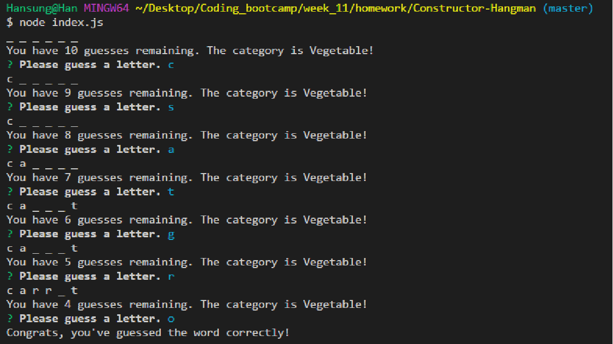

# Constructor-Hangman

This is a terminal line hangman game using Inquirer. Inquirer is a Node npm package that allows you to create terminal line prompts. In this game, the user tries to guess a hidden word and receives feedback from the computer regarding whether or not the guesses are correct. 

## How to Play

Since this is a terminal line node application, you will need to have the inquirer npm package installed. You can start the game by typing "node index.js" in your terminal. This will prompt you to choose a letter. Continue choosing letters until you either complete the word or run out of guesses. The following is a screenshot of what the game looks like: 

